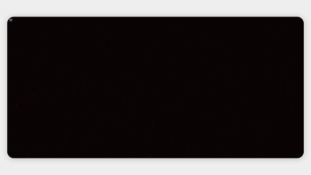

# Generative Particle Flow

A small generative art experiment built with **p5.js**.

The project uses particles, Perlin noise, and randomized colors to create an evolving flow-field animation. Particles continuously move through the noise field, change direction, fade out, and respawn to create a constantly changing visual.

<p align="center">
  
</p>

## Features

- Generative particle system
- Perlin noise-based movement
- Randomized color palettes
- Particle fading and respawning
- Interactive refresh and animation controls
- Optional background music
- Responsive canvas

## How It Works

Each particle follows a direction calculated from a Perlin noise field. Its movement is quantized into small directional steps, creating flowing and organic patterns.

Particles gradually lose their lifetime and are replaced when they disappear, keeping the animation continuously evolving.

## Run Locally

Clone the repository and open `index.html` in a browser.

```bash
git clone https://github.com/your-username/your-repository.git
cd your-repository
```

Make sure `music.mp3` is present in the project directory if you want to use the music feature.

## Built With

- [p5.js](https://p5js.org/)
- JavaScript
- HTML / CSS

## Demo

[Live Demo](https://xylight0.github.io/advanced_sand/)

---

<p align="center">
  <sub>Generative art • particles • noise • randomness</sub>
</p>
